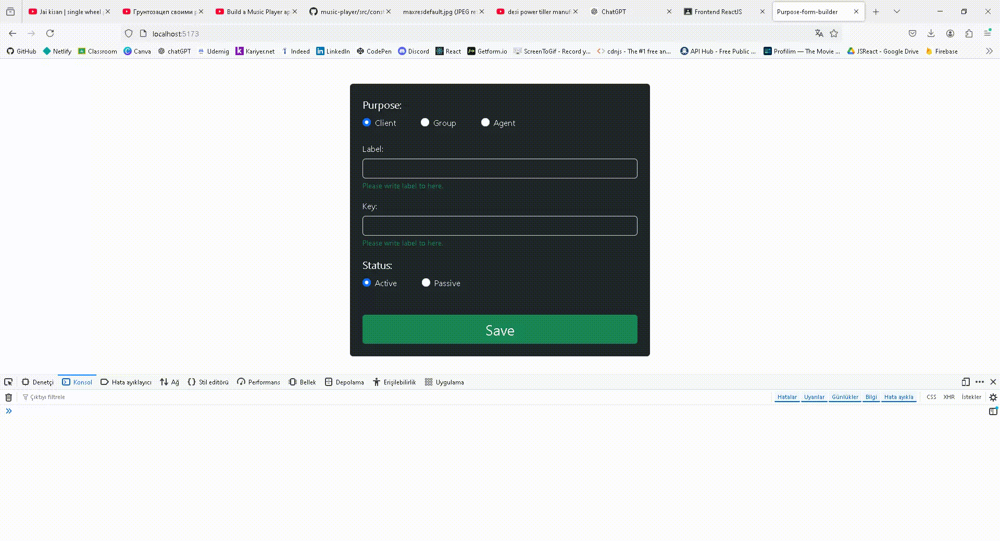

# Purpose Form Builder

Purpose Form Builder, React ve React-Bootstrap kullanarak kullanıcıdan veri almak için tasarlanmış bir form bileşenidir. Bu form, kullanıcıların `Label`, `Key`, `Purpose`, ve `Status` gibi bilgileri girmesine olanak tanır. Form verileri başarıyla kaydedildikten sonra sıfırlanır.

## Özellikler

- Kullanıcıdan veri alır: `Label`, `Key`, `Purpose`, `Status` alanlarını içerir.
- Eksik alanlar için uyarı verir.
- Formu başarıyla kaydeder ve temizler.
- Bootstrap kullanılarak şık ve kullanıcı dostu bir arayüz sağlar.

## Kullanılan Teknolojiler

- **React**
- **React-Bootstrap**
- **React Hooks** (useState)

## Önizleme

